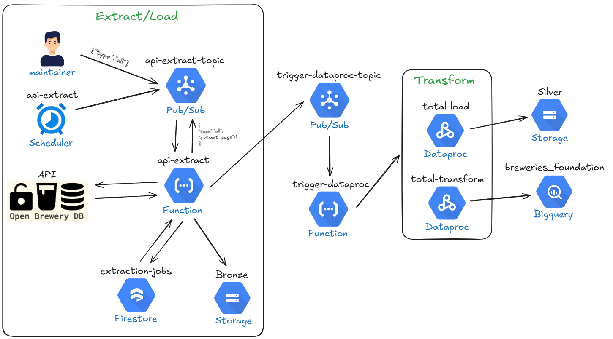
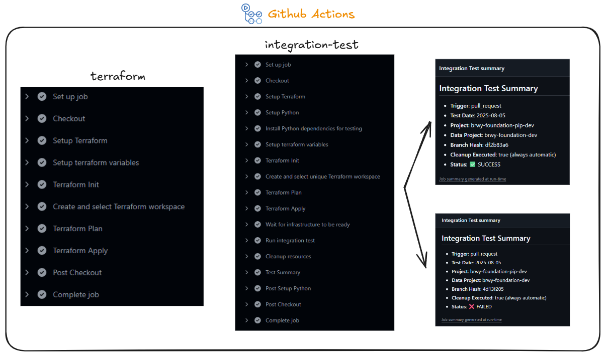

# brwy-foundation

Sistema escalável de extração, processamento e análise de dados de cervejarias utilizando Google Cloud Platform, via terraform, e API breweries DB. O projeto implementa uma arquitetura tipo medalhão (Bronze/Silver/Gold) com processamento paralelo e orquestração automatizada.

Esse processo foi pensado para processos escaláveis tanto em processamento quanto em equipe, possibilitando trabalhar com grandes volumes de dados e desenvolvimento paralelo.

## Arquitetura Geral

O sistema utiliza uma pipeline de dados distribuída com as seguintes características:

- **Escalabilidade**: Processamento paralelo através de Pub/Sub e Function
- **Observabilidade**: Logs centralizados e monitoramento de qualidade de dados
- **Automação**: CI/CD completo com testes de integração que possibilita o trabalho em várias branchs de desenvolvimento.

### Fluxo do Pipeline



### Camadas de Dados

- **Bronze**: Dados brutos em formato JSON organizados por data
- **Silver**: Dados processados em formato Parquet com tipagem e limpeza
- **Gold**: Dados agregados no BigQuery com views analíticas

## Componentes do Sistema

###  Extração de Dados (API-Extract Function)

Essa função é responsável pela extração de dados da Open Brewery DB API com suporte a diferentes tipos de extração:

- **`all`**: Extração completa de todas as cervejarias
- **`by_state`**: Extração por estado (em desenvolvimento)  
- **`by_type`**: Extração por tipo (em desenvolvimento)

```json
{
  "type": "all",// pode ser by_state ou by_type
  "extract_page": 1, // opcional, para processamento de uma pagina especifica
  "state": "Busan",     // obrigatorio, para by_state
  "brewery_type": "micro"  // obrigatorio, para by_type
}
```

**Funcionalidades:**

- A function inicia o processo consultando o endpoind de metadados, calcula a quantidade de paginas e se auto dispara, via pub/sub, para cada pagina.

- Cada pagina disparada, por sua vez, extrai os dados e salva em formato JSON no bucket Bronze, além de atualizar as informaçôes no Firestore de forma atômica (transacional).

- Ao verificar que todos os arquivos foram registrados no Firestore, a function publica uma mensagem no `trigger-dataproc-topic` com intuito de disparar o processo de transformação.

#### Formato dos arquivo JSON (Bucket Bronze)
```
gs://bucket-bronze/YYYY-MM-DD/YYYY-MM-DD_page_XX.json
```

### Controle Transacional (Firestore)

Gerencia o estado da extração através da coleção `extraction_job`:
- É utilizado o decorator @firestore.transacional para registrar a pagina processada e consultar a quantidade de paginas totais e comparar com a quantidade de paginas processadas.
- Esse processo garante o rastreamento do progresso da extração, além de, contornar os problemas de concorrencia garantindo disparo unico para o `trigger-dataproc`.


#### Estrutura do Documento Firestore
```json
{
  "date": "2025-08-05",
  "completed_pages": 
  {
    1:
    {
        "page_number": 1,
        "status": "completed",
        "processed_at": "2025-08-05T12:00:00Z"
        
    }
    ...
  }
  "total_pages": "43",
  "dataproc_triggered": false,
}
```

###  Orquestração (Trigger Dataproc Function)

Função responsável por disparar os jobs Dataproc baseado no tipo de extração:

- Orquestração de templates Dataproc
- Passagem de parâmetros dinâmicos
- Monitoramento de execução

###  Processamento de Dados (Jobs Dataproc PySpark)

Para o processo do Dataproc foi utilizado as configurações:
- **Machine Type**: n1-standard-2
- **Worker Nodes**: 2
- **Spark Properties**: Configurações otimizadas para BigQuery, alocação dinâmica e sql adaptativo.

#### Step total-load:
Transformação de JSON para Parquet (Bronze → Silver):
- Renomeação e padronização de colunas
- Tipagem adequada de campos
- Particionamento por data

#### Step total-transform:
Carregamento para BigQuery (Silver → Gold):
- Aplicação de regras de negócio
- Validação de qualidade de dados
- Carregamento na tabela `breweries-all-data`

### Camada Analítica (BigQuery)

#### Tabela Principal
- **`breweries-all-data`**: Dados consolidados de todas as cervejarias
- Particionados por data e clusterizados por type e state

**Campos da tabela:**
- `id_brewery` (STRING): Identificador único da cervejaria
- `name_brewery` (STRING): Nome da cervejaria
- `type_brewery` (STRING): Tipo de cervejaria (micro, brewpub, etc.)
- `address_line_1` (STRING): Primeira linha do endereço
- `address_line_2` (STRING): Segunda linha do endereço
- `address_line_3` (STRING): Terceira linha do endereço
- `name_city` (STRING): Nome da cidade
- `name_state_province` (STRING): Nome do estado ou província
- `value_postal_code` (STRING): Código postal/CEP
- `name_country` (STRING): Nome do país
- `longitude` (FLOAT): Coordenada de longitude
- `latitude` (FLOAT): Coordenada de latitude
- `phone` (STRING): Número de telefone
- `url_website` (STRING): URL do website
- `name_state` (STRING): Abreviação do estado
- `name_street` (STRING): Nome da rua
- `processing_date` (DATE): Data de processamento do registro
- `processing_timestamp` (TIMESTAMP): Timestamp de processamento
- `source_date` (DATE): Data dos dados de origem
- `full_address` (STRING): Endereço completo formatado
- `year` (INTEGER): Ano da data de origem
- `month` (INTEGER): Mês da data de origem
- `day` (INTEGER): Dia da data de origem
- `has_coordinates` (BOOLEAN): Se a cervejaria possui coordenadas válidas
- `has_contact_info` (BOOLEAN): Se a cervejaria possui informações de contato

#### Views Agregadas
- **`breweries_by_state`**: Agregação por estado
- **`breweries_by_type`**: Agregação por tipo
- Métricas de qualidade (percentual de preenchimento por campo)

## Infraestrutura e Ambientes

### Ambientes

#### Desenvolvimento
- `brwy-foundation-dev`
- `brwy-foundation-pip-dev`
- Replicação automática por branch com sufixo "-branch", pensado para desenvolvimento paralelo em grandes equipes
- Buckets e tabelas no ambiente de desenvolvimento têm proteção de exclusão desativas

#### Produção
- `brwy-foundation`
- `brwy-foundation-pip`

### CI/CD (GitHub Actions)


#### terraform.yml
- Deploy automático a cada push
- Reimplementação de infraestrutura alterada
- Validação de sintaxe Terraform

#### integration-test.yml
- Criação de infraestrutura temporária (sufixo hash)
- Teste end-to-end completo:
  - Disparo da `test_api_extract`
  - Monitoramento de logs das functions
  - Validação de execução Dataproc
  - Testes de qualidade no BigQuery
- Limpeza automática de recursos

## Operação e Monitoramento

### Agendamento
- Execução diária às 09:00 (horário de Brasília)
- Histórico incremental dia-a-dia

### Armazenamento Temporal
- O processo foi pensado para manter um histórico de dados organizados por data de extração, pensando no rastreamento de mudanças de tipo de cervejarias e identificação de registro de novas cervejarias

## Estrutura do Projeto

```
├── docs/                     # Documentação e diagramas
│   ├── pipeline.png          # Fluxo completo do processo
│   └── actions.png           # GitHub Actions workflows
├── *.tf                      # Arquivos Terraform (infraestrutura)
├── scr/
│   ├── functions/            # Cloud Functions
│   │   ├── api-extract/      # Extração de dados da API
│   │   └── trigger-dataproc/ # Orquestração Dataproc
│   └── dataproc/            # Jobs PySpark
│       ├── breweries/
│       │   ├── load/         # total-load (JSON → Parquet)
│       │   └── transform/    # total-transform (Parquet → BigQuery)
├── scripts/                  # Scripts utilitários
├── tests/                    # Testes de integração
└── test/                     # Dados de exemplo
    ├── bronze/               # Dados brutos de exemplo
    └── silver/               # Dados processados de exemplo
```


## Referências Técnicas

- [Terraform GCP Guide](https://developer.hashicorp.com/terraform/tutorials/gcp-get-started/google-cloud-platform-build)
- [Setup Actions](https://developer.hashicorp.com/terraform/tutorials/gcp-get-started/google-cloud-platform-build)
- [Provider Setup](https://developer.hashicorp.com/terraform/language/providers/requirements#requiring-providers)
- [Build Trigger-Dataproc](https://cloud.google.com/python/docs/reference/dataproc/latest/google.cloud.dataproc_v1.services.workflow_template_serviceWorkflowTemplateServiceClient#google_cloud_dataproc_v1_services_workflow_template_service_WorkflowTemplateServiceClient_instantiate_workflow_template)
- [Settings BigQuery Connector](https://github.com/GoogleCloudDataproc/spark-bigquery-connector)
- [GitHub Actions Context](https://docs.github.com/en/actions/reference/workflows-and-actions/contexts)